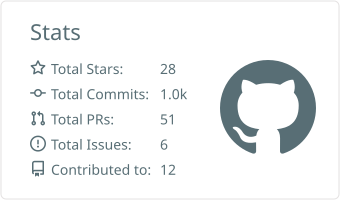
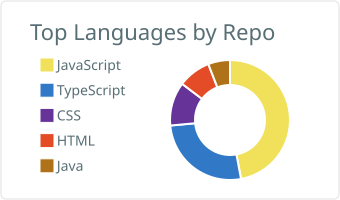
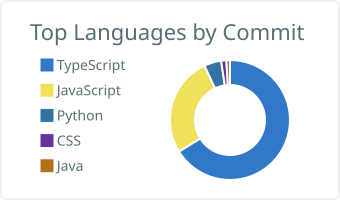
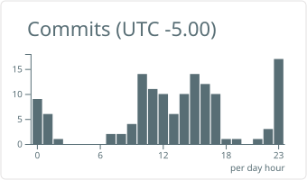

# Hey, I'm Santi 👋

**Solutions Architect** based in Cincinnati, OH — I design and ship systems across **AWS, Azure, and GCP**, and I've never met a stack I wasn't willing to learn.

- 🧩 I treat engineering like puzzle-solving: understand the problem deeply first, then make the solution look obvious
- 🚀 Pragmatic to the core — I optimize for shipping, for clarity, and for the person who maintains the code after me
- 🎓 Teaching is my favorite multiplier: I've run courses and hands-on workshops because knowledge shouldn't live in one head
- 🤝 Ask my teammates: relentlessly curious, easy to work with, and stubborn in the one way that matters — I don't leave problems unsolved
- 🌐 More about me at **[santisiordia.com](https://santisiordia.com)**

## 🛠️ Tech I work with

**Languages & frameworks**

**Tools**

**Cloud**

![Microsoft Azure](https://img.shields.io/badge/Microsoft_Azure-0078D4?style=flat-square&logo=data%3Aimage%2Fsvg%2Bxml%3Bbase64%2CPHN2ZyBmaWxsPSIjZmZmZmZmIiB2aWV3Qm94PSIwIDAgMTI4IDEyOCIgeG1sbnM9Imh0dHA6Ly93d3cudzMub3JnLzIwMDAvc3ZnIj48cGF0aCBkPSJNNDMuOTgzIDQuNjUzYTUuOTExIDUuOTExIDAgMDE1LjYgNC4wMjJsMzUuOTEgMTA2LjM5NmE1LjkxMSA1LjkxMSAwIDAxLTUuNjAzIDcuODAyaDQxLjM4YTUuOTE3IDUuOTE3IDAgMDA0LjgtMi40NjUgNS45MDkgNS45MDkgMCAwMC43OTgtNS4zNEw5MC45NjEgOC42NzJhNS45MSA1LjkxIDAgMDAtNS42MDItNC4wMjJ6bS0xLjMzNi40NzhhNS45MiA1LjkyIDAgMDAtNS42MSA0LjAyOUwxLjEzMiAxMTUuNTVhNS45MSA1LjkxIDAgMDA1LjYgNy44aDI4Ljg5M2MxLjIzOSAwIDIuNDQ2LS40MSAzLjQ1Mi0xLjExM2E1LjkyMyA1LjkyMyAwIDAwMi4xNTctMi45MTZsNy4wMTktMjAuNzEtMTMuNDExLTEyLjg1N2MtLjI0Ni0uMjczLTEuMzUzLTIuMjc0LS4zNjktNC4wMDIgMS4xMDgtMS42NTkgMi45NTUtMS42NTkgMi45NTUtMS42NTloMTcuMjg1bDkuMDc0LTI2LjE0NUw0OC4yNzQgOC4zMjFjLS4wNDItLjIwNS0uOTE0LTEuMzY1LTIuMjgxLTIuMjgtMS4zNy0uOTE1LTMuMzQ1LS45MDktMy4zNDUtLjkwOXptLTQuODggNzUuNzRhMi43MjQgMi43MjQgMCAwMC0xLjg2IDQuNzE4bDM3LjgzIDM1LjMxYzEuMTAxIDEuMDMgMi41MDIgMS42MzEgNC4wMDcgMS42MzEgMCAwIDEuMjgyLjA2OCAyLjA1NS0uMDMzIDEuODE3LS4yNzMgMy41MjUtMS43NjggNC4wOS0yLjM5IDEuNDU3LTEuOTM5Ljc5NC00Ljk1Ljc5NC00Ljk1bC0xMS40NS0zNC4yOHoiIC8%2BPC9zdmc%2BCg%3D%3D)

**AI tooling**

## 📊 Stats

  
  

  
  

---

💬 The bio says it all: *I code a lot.*
